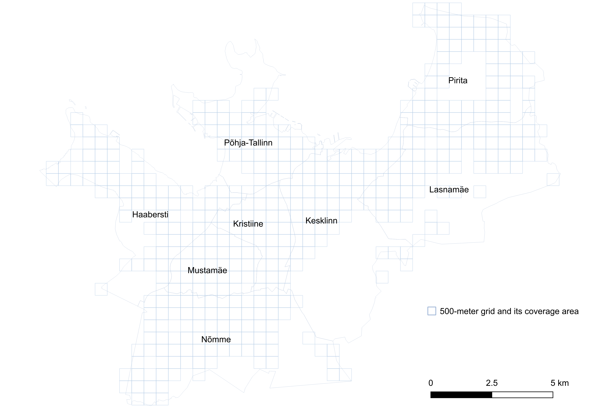

# Analyzing the relationships between crime and socioeconomic and spatial factors using random forest

The spatial factors of crime and its socioeconomic background are important topics in crime research. This study uses a grid framework to represent various spatial, environmental, and socioeconomic factors across Tallinn in 500-meter grids. The study aims to predict the number of crimes in each grid cell through a random forest machine learning model and identify the main contributing factors. 

## Data

The crime data from the Estonian Police and Border Guard Board was classified and used as the dependent variables. The covariates used the roads, land use, points of interest (POIs), green spaces, housing, and demographic and socioeconomic data. In total, 40 covariates were used as predictors, and three dependent variables of the crime were used as targets to be predicted 

|Dataset	|Variable	|Unit	|
| :---: | :---: | :---: | 
|Crime|	Crimes against public order / Crimes against property / Total crime incidents|	Number of incidents per grid cell|
|Road| Trail / Neighborhood level / City level|	Length (meters) per grid cell|
|Land use| Discontinued dense urban fabric / Discontinued medium dense urban fabric / Industrial, commercial, public, military, and private units / Continuous urban fabric |	Area (square meters) per grid cell|
|Green space| Area of green space|	Area (square meters) per grid cell| 
|Diversity of land use| Number of land use and green space types | Number of land use types per grid cell|
|Point of Interest	| Commercial / Recreational / Public services / Camera surveillance|	Number of points per grid cell|
|Housing type| Small-scale apartment house / Standalone house / Large-scale apartment house / Auxiliary house / Others|	Number of houses per grid cell|
|Demographic, socioeconomic, and housing |Age groups (10) / Ethnicity (2) / Socioeconomic status (3) / House conditions (3) / House ownership (2)|	Number of people per grid cell|
|Spatial |X and Y coordinates|	X and Y coordinate of the grid cell centroid|

To process data into a format that a machine learning model can handle, the datasets were processed into a tabular form, with each column being a covariable or a dependent variable. Each row represented a grid cell containing features described by the columns. The structured tabular form simplified the relationship between covariables, especially when all cells were lined up as a one-dimensional array, and the original spatial relationship among the covariables might be removed. The X and Y coordinates were added to maintain the spatial relationship. 

## Results
The study results present the model for predicting crimes against public order, which has achieved good results (R2 scores of 0.79 in training and 0.62 in testing). The top three main factors are the population of residents aged 20 to 29, the number of commercial POIs, and the number of renters. Other moderate factors are the population of residents aged 50 to 59, low socio-economic status, and the population of residents aged 10 to 19. 
The model for predicting crimes against property has reasonably good results (R2 scores are 0.46 in training and 0.28 in testing). The number of commercial POIs is the primary factor. Other factors have a limited impact on the model. 
The third model combines the two types of crimes to predict overall crime numbers and has reasonably good results (R2 scores are 0.47 in training and 0.32 in testing), with commercial POIs being the most important factor as well. All these results are experimented under controlled hyperparameters and random seed.

## Author
Cheng-Wei Yu

## Acknowledgements
Sincere thanks to 
- Prof. Evelyn Uuemaa
- PhD Kadi Kalm
- PhD Alexander Kmoch
- MSc Jānis Zālīte

for supervising this study.

 - [Geoinformatics for Urbanised Society, University of Tartu](https://ut.ee/en/curriculum/geoinformatics-urbanised-society)
